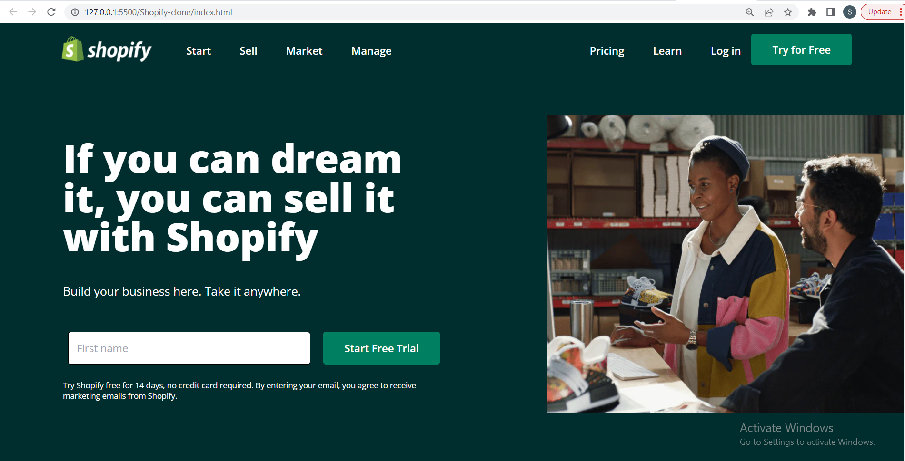
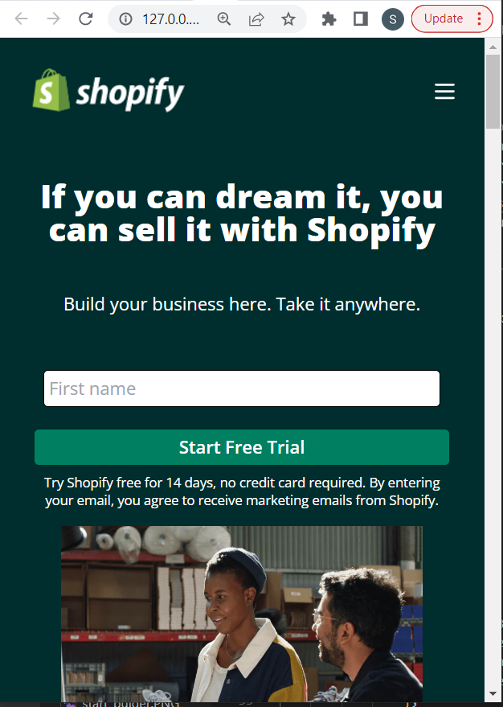

# Shopify-Clone [](http://www.gnu.org/licenses/agpl-3.0)

This is basically a clone of [Shopify](https://shopify.com/) made purely in HTML5 and tailwind css a utility first css Framework.
This has also been made mobile responsive for better view using Tailwind CSS
Hope you like my project !!

## 🛠 Technologies Used
  - HTML - Hyper Text Markup Language
  - Tailwind css - A Utility First Framework of CSS
  - CSS - Cascading Spread Sheet

## 🚩 Demo
### Laptop View


### Mobile Screen View


## Run Locally

Clone the project

```bash
  git clone https://github.com/suhas-sm/Shopify-clone.git
```

Go to the project directory

```bash
  cd Shopify-clone
```
## ✍️ Author and 📞 Contact
- [Find-coder](https://www.findcoder.io/u/suhas_sm)
    - [](https://www.facebook.com/suhas.melmuri)
    - [](https://www.instagram.com/_suhas_sm/)

## 📝 Features

- Royalty Free Images used
- Hover Effect
- Beautifull UI/UX Design
- Clone Website
- Hosted on Netlify and set up in production
- Tried to replicate Shopify website
- Used different images in some places
- Made it mobile responsive
- Fully Responsive in all screens

## 🤔 What i have learnt By working on this project
1. Got a good understanding of mobile first tailwind CSS and making it responsive in all screens.

## 😌 Honest Time to finish the project

I had took about 10 hrs.

## 👀 Feedback
If you have any feedback, please reach out to us at melmurissm11@gmail.com
